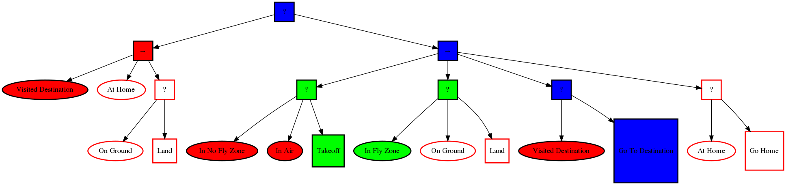
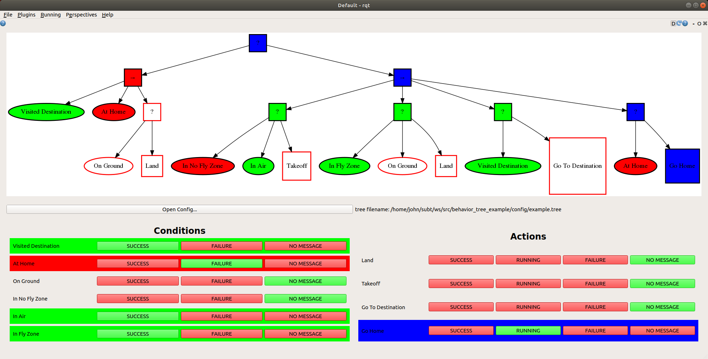

# Behavior Tree

This package is a ROS implementation of a behavior tree.



## Overview

Behavior trees define how a set of actions and conditions should be used to accomplish a task. The tree is made up of execution nodes, control flow nodes, and decorator nodes.

Action nodes and condition nodes are the two types of execution nodes. These nodes are where the state of the system is checked and actions are performed. A condition node returns either SUCCESS or FAILURE to indicate what the state of some part of the system is. For example, an "On Ground" condition node could indicate whether or not the robot is on the ground. These are shown as the oval shaped nodes in the figure above. Green ones indicate SUCCESS, red ones indicate FAILURE. If the body of the node is filled with color, this indicates that the behavior tree is currently checking the value of the condition. If the body color is white but the outline is colored, this means that the behavior tree is not currently checking the value of the condition, so it is not using it to decide which actions to perform. Action nodes are used to make the system perform some action if they are active. Action nodes are shown as square nodes with text in the figure above. They can be either active or inactive. Active nodes are shown with a red, blue, or green body color, inactive nodes are shown with a white body color. If a node is active this means the behavior tree has decided to perform the action. If the node is inactive the behavior tree is not trying to perform the action. For example, if the robot should be taking off, then the "Takeoff" action should be active, while the "Land" action should be inactive. An active action node can have a SUCCESS, RUNNING, or FAILURE status. SUCCESS indicates that the action has is done being performed and finished successfully, FAILURE indicates the action is done but has failed, RUNNING indicates that the action is still being performed. In the figure above green corresponds to SUCCESS, blue to RUNNING and red to FAILURE for action nodes.

Control flow nodes determine which condition nodes are checked and which action nodes are active or inactive. There are three types of control nodes currently implemented:

- Fallback Nodes: This node returns FAILURE if and only if all of its children return FAILURE. If one of its children return RUNNING or SUCCESS, it returns RUNNING or SUCCESS and no subsequent children's statuses are checked. These are shown with a ? in the figure above.
- Sequence Nodes: This node returns SUCCESS if and only if all of its children return SUCCESS. If one of its children return RUNNING or FAILURE, it returns RUNNING or FAILURE and no subsequent children's statuses are checked. These are shown with a → in the figure above.
- Parallel Nodes: This node has N chldren. It returns SUCCESS if M of these children return SUCCESS, for some M ≤ N. It returns FAILURE of N - M + 1 children return FAILURE. Otherwise, it returns RUNNING.

Decorator nodes have one child and its return value is determined by some user defined rule given the child's status as input. There is currently one type of decorator nodes implemented:

- Not Decorator Node: This has a single condition node as a child. If the child returns SUCCESS, the Not Decorator returns FAILURE. If the child returns FAILURE, the Not Decorator returns SUCCESS.

A more detailed description of behavior trees can be found here: https://arxiv.org/pdf/1709.00084.pdf.

## ROS Interface

This section describes how the behavior tree is implemented in ROS and how nodes implementing conditions and actions should interact with it. A full working example can be found in this repository: [https://bitbucket.org/cmusubt/behavior_tree_example/src/master/]

Click the image below to play the video. This is a demo of the behavior tree. It can be run using the behavior_tree_example package.

[](https://www.youtube.com/watch?v=-xRF52uCHo8 "Behavior Tree Example")

### Defining the Structure

The strucutre of the behavior tree is defined with a configuration file, an example of which is shown below:

```
->
	?
		(Example Condition)
		[Example Action]
```

The first node in the behavior tree above is a Sequence node indicated by a "->". Tabs are used to indicate a parent chlid relationship. The Sequence node has a child Fallback node, indicated by a "?". This Fallback node has two children, a condition node "(Example Condition)" and an action node "\[Example Node\]". Condition nodes must be surrounded by parenthesis, action nodes must be surrounded by square brackets. The text inside of the parenthesis/brackets can be anything. This is meant to correspond to how the are visualized in the graph.

Parallel nodes are declared with "|| 2", where 2 is the number of child nodes that need to return SUCCESS. Decorator nodes are declared with "<X>" where X is the type of decorator node, for example, a Not Decorator Node would be declared "<!>". Other behavior tree files can also be included using the syntax "include filename" where filename is an absolute path to a behavior tree file. This filename supports the $(find pacakge_name) syntax that roslaunch also supports. Examples use cases can be found in the behavior_tree_example package in examples 2 and 3.

### Implementing Conditions and Actions

Below is a description of how to implement conditions and actions using the Condition and Action classes in the behavior_tree package.

*Important Note:* You need to publish the status of the action or condition at a sufficiently high frequency so that the behavior tree does not consider them to be timed out. The behavior tree has a ROS parameter called "timeout" which indicates the amount of time in seconds it can go without receiving a status from before it considers the action or conditions to be timed out.

#### Condition and Action Helper Classes

Instead of directly sending ROS messages, you can use Condition and Action helper classes that set up the publishers and subscribers for you. Make sure your CMakeLists.txt and package.xml depend on the behavior_tree package.

- Conditions

Include the library:

```c++
#include <behavior_tree/behavior_tree.h>
```

Initialize a condition:

```c++
bt::Condition condition(node_handle, "Example Condition");
```

The second argument to the Condition class's construcutor is the same text that the condition node is labled with in your config file. The class automatically creates a subscriber to the corresponding topic that the behavior_tree expects to receive the std_msgs::Bool on.

Now, set the value of the condition and publish it. As before, make sure to publish at a high enough frequency:

```c++
condition.set(true);
condition.publish();
```

You can also get the value of the condition using get(), which returns a bool:

```c++
bool success = condition.get();
```

- Actions

Include the library:

```c++
#include <behavior_tree/behavior_tree.h>
```

Initialize an action:

```c++
bt::Action action(node_handle, "Example Action");
```

Like the condition node, the Action constructor's second argument is the same text that is on the label of the action node in your config file. The class automatically creates a subscriber to the std_msgs::Bool topic that tells whether the action is active, and a publisher that publishes the std_msgs::String status. Make sure that the node handle you pass to the Action class has a callback queue that can handle receiving the std_msgs::Bool without being delayed too much by  other callbacks.

Now, if the action is active, set the status of the action and publish it. Make sure to publish at a high enough frequency.

```c++
if(action.is_active()){
	action.set_success();
	// or action.set_running();
	// or action.set_failure();

	action->publish();
}
```

You can also check the status you set the action to with the following functions which return bools:

```c++
action.is_success();
action.is_running();
action.is_failure();
```

### Debugging Tools

There are also some debugging tools for visualizing the tree and seeing how it behaves with different conditions and actions.

#### Image Publisher

The behavior tree publishes a graphviz string that can be made into an image. You can use the `behavior_tree_image_publisher.py` node to subscribe to the graphviz string and publish an image. This is done in the behavior_tree_example launch file.

#### RQT Debug GUI

There is an rqt GUI for debugging that your behavior tree works as you expect. Using the interface shown below, you can set the status published by each condition and action using the buttons. This way you don't have to debug the strucuture of your behavior tree by creating ROS nodes.

To use the plugin, make sure the workspace you build the behavior_tree packages is sourced (source devel/setup.bash) and run `rqt`. In the `Plugins` menu there should be a `Behavior Tree` menu containing the `Behavior Tree` plugin. When you open it for the first time, it won't have a config file loaded. Use the `Open Config...` button and select your behavior tree config file.




Author: John Keller slack: kellerj email: jkeller2@andrew.cmu.edu